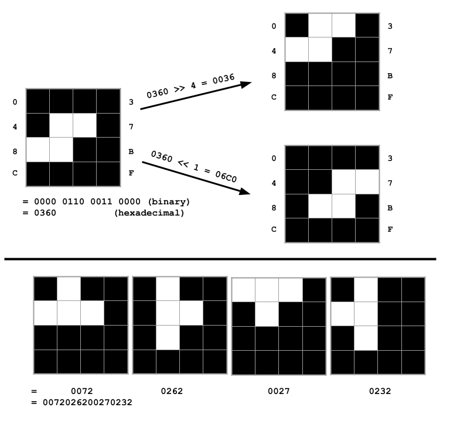
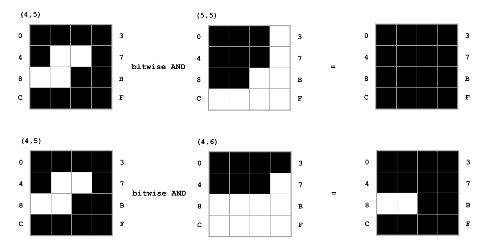
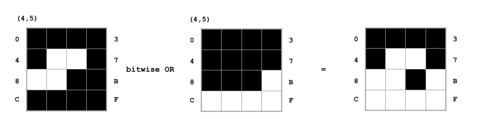
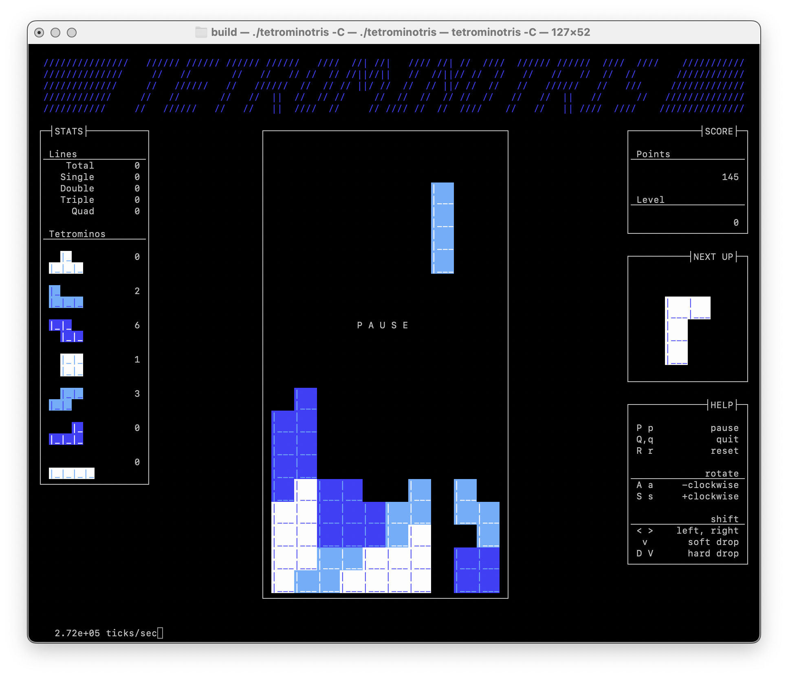
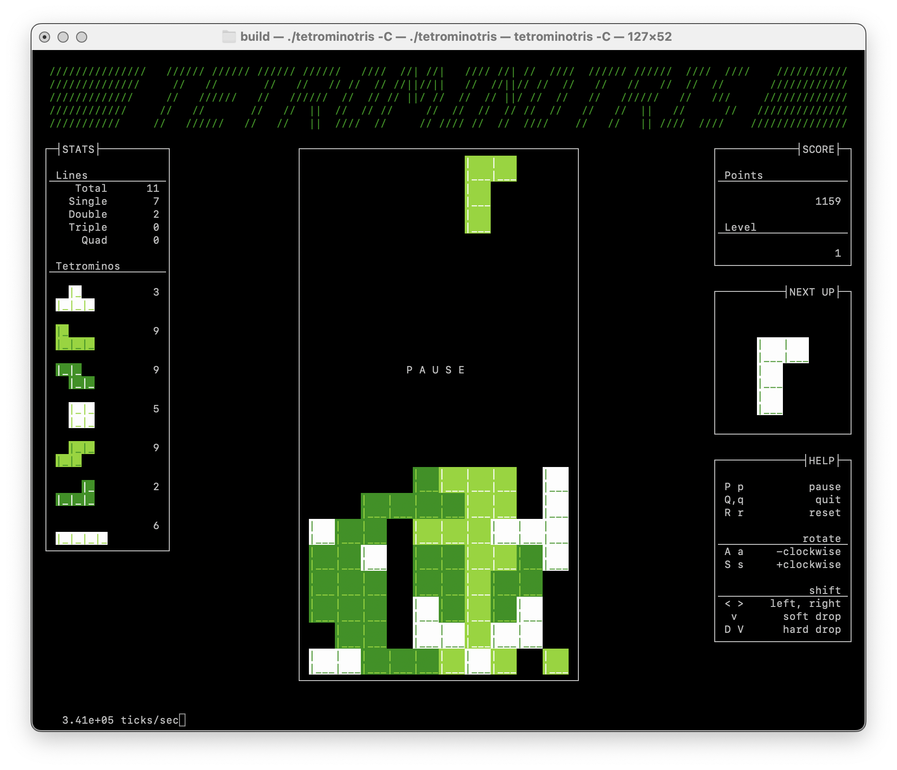
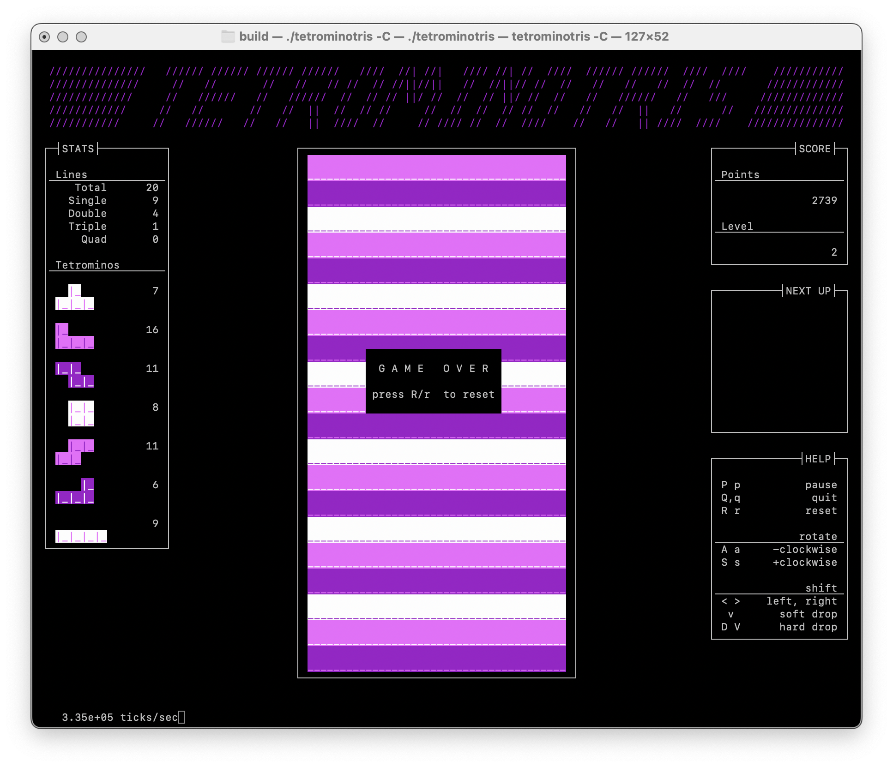

# tetrominotris

Because I've shown in interest in videos about programming and emulation, YouTube loves to suggest similar content to me.  One night as I was doing the dishes it chose to show me a video by OneLoneCoder wherein he tackled that wonderful game called Tetris.  As he was discussing how he would represent the 4x4 tetromino pieces as 16-character strings my reaction was to wonder why not just use a 16-bit integer, with each bit being an un/occupied state.  Translation within the 4x4 cell could easily be handled as bit shift operations, as shown in Figure 1:



The game allows the tetromino piece to be rotated 90, 180, and 270 degrees as it falls, so there are nominally 4 representations for each piece (in some cases symmetry reduces it to 2 or 1 unique representation).  But 4 x 16-bit integers is just a single 64-bit integer, so all orientations of a tetromino will fit in a 64-bit integer (call it a 64-bit word), as shown for the "T" tetromino above.  Each orientation can be extracted by means of a bitwise AND and a bit shift:

```
orientation_4 = (tetromino & 0x000000000000FFFF)
orientation_3 = (tetromino & 0x00000000FFFF0000) >> 16
orientation_2 = (tetromino & 0x0000FFFF00000000) >> 32
orientation_1 = (tetromino & 0xFFFF000000000000) >> 48
```

An important part of the game is collision detection.  When the player attempts to move the piece left or right on the game board, the game must determine if that move is obstructed by pieces already placed on the board.  Likewise, when the piece drops a row — either due to soft or hard drop or the game's periodic gravity — if a collision is detected the action does not yield a move, rather the final placement of the tetromino on the game board.

Extracting a 4x4 region of the game board state will also yield a 16-bit word representing the un/occupied state of the enclosed cells.  If the in-play tetromino is at (4,5) on the game board, a move to the right would put it at (5,5).  If the 4x4 region of state at (5,5) is extracted, collision detection is quite simple:



When the bitwise AND yields zero there is no collision, whereas non-zero implies a collision would occur.  Thus, the move to the right is valid while the move down will place the tetromino on the board at its current position, (4,5).  That act of placing the in-play tetromino on the board happens with a bitwise OR rather than an AND, with the result being written back to the board data:



Rats, I really should have moved to the right that time.

The standard Tetris game board is 10 columns by 20 rows, so it could be represented as an array of 20 16-bit words.  There would be 6 unused bits in each word, with the usable bits masked by the value `03FF` and the unused portion by `FC00`.  Checking for a filled row is a very simple operation:

```
(row & 0x03FF) == 0x03FF
```

Finding completed rows is a straightforward (and quick) bitwise AND and comparison (subtraction).  Removing a row amounts to moving all words preceding it over top of it and filling-in at the head of the array with zeroes.

The heart of tetrominotris is a bit grid C pseudo-class that handles all of the bit ops discussed.

## Color

As originally written the game was black and white only.  Color requires that each position on the game board not only have the un/occupied bit, but some number of additional bits representing a color.  The traditional NES variant of Tetris used a single 4-color palette for the game pieces in each level, so 2 additional bits are needed for color data.  The bit grid pseudo-class was altered to allow for 1 to 8 distinct bit planes.  Row removal shifts data in all planes, and the rest of the operations allow for selection of one or more target bit planes.

The original black and white display mode uses a single bit plane and the un/occupied state also effectively maps to black/white color.  In color mode, the un/occupied state determines the empty/filled nature of a cell and bit planes 1 and 2 are a two-bit color index (`0b00 = 0`, `0b01 = 1`, `0b10 = 2`, `0b11 = 3`).  Only values 0, 1, and 2 are used by the game.

The curses libary offers a limited number of colors by default (when color is supported by the terminal).  However, some terminal types allow a wider range of color support, and curses can in those cases have color indices reconfigured with arbitrary RGB values.  The curses RGB components are in the range [0,1000].  I found an NES color table with [Tetris 3-color palettes](https://kirjava.xyz/tetris-level-colours/) online and was able to extract its array of RGB values and array of color index triples for each Tetris palette (palette change is synchronized with  the level's increasing).  A function to interpolate 8-bit RGB component values from the table to curses-range values converts the colors on-the-fly.

## Key mapping

The game was also originally written with a fixed configuration of keys that mapped to game events.  The **a**/**A** key rotated the in-play tetromino anti-clockwise.  Inevitably *someone* out there will find my choice of keys annoying or unusable, though, so abstracting the mapping of keyboard keys to game events was a useful addition.

The game will always recognize the left and right arrow keys to trigger left or right movement of the in-play tetromino.  The down arrow key will always trigger soft drop of the in-play tetromino, and the **q**/**Q** key will always exit the game.  Otherwise:

- Every event must have at least one keyboard key mapped to it
- No keyboard key can have multiple events mapped to it

The game events are:

- `MOVE LEFT`
- `MOVE RIGHT`
- `SOFT DROP`
- `HARD DROP`
- `ROTATE CLOCKWISE`
- `ROTATE ANTICLOCKWISE`
- `PAUSE`
- `RESET`

A key-mapping file declares associations between keys and events:

```
# File can have comments
R r   = RESET
P p   = PAUSE
J j   = MOVE LEFT
L l   = MOVE RIGHT
K k   = SOFT DROP
SPACE = HARD DROP
A a   = ROTATE ANTICLOCKWISE
S s   = ROTATE CLOCKWISE
```

The list of one or more keys is whitespace-delimited, with the special token `SPACE` for the spacebar.  The list is followed by an equal sign, then a single game event name.

The built-in mapping is as follows:

```
R r   = RESET
P p   = PAUSE
, <   = MOVE LEFT
. >    = MOVE RIGHT
D V d v = HARD DROP
A a   = ROTATE ANTICLOCKWISE
S s SPACE  = ROTATE CLOCKWISE
```

A user-defined mapping file following the format described above can be passed to the program on the command line to alter gameplay.

## High Scores

The program can be configured at build with a singular path at which a high score file should be kept.  The `TETROMINOTRIS_HISCORES_FILE` CMake variable can be set to the desired path to the file.

```
$ cmake … -DTETROMINOTRIS_HISCORES_FILE=/var/lib/tetrominotris/hi-scores …
```

Three records are retained, each consisting of the score, the level reached, the initials chosen by the player, and a timestamp.  (In early commits it retained the Unix uid number so that on shared systems anyone using naughty initials could be identified, but then I realized after entering 'Poo' that I'd only be catching myself.)  If the user has write privilges on the parent directory of the file, then removing the file will allow it to be regenerated on the next game play.

There are effectively only two spots for which players can vie because the top-ranked game always belongs to JTF.

## General usage

```
$ ./tetrominotris --help

usage:

    build/tetrominotris {options}

  options:

    --help/-h                      show this information
    --word-size/-S <word-size>     choose the word size used by the game
                                   engine's bit grid (default: opt)
    --width/-w <dimension>         choose the game board width
    --height/-H <dimension>        choose the game board height
    --color/-C                     use a color game board
    --basic-colors/-B              use basic curses colors rather
                                   than attempting to use custom palettes
    --level/-l #                   start the game at this level (0 and
                                   up)
    --keymap/-k <filepath>         initialize the key mapping from the
                                   given file
    --utf8/-U                      allow UTF-8 characters to be displayed

    <dimension> = # | default | fit
              # = a positive integer value
        default = 10 wide or 20 high
            fit = adjust to fit the terminal

    <word-size> = opt | 8b | 16b | 32b | 64b
            opt = whichever bit size minimizes wasted bits and maximizes
                  bits-per-word

version: 1.1.1

```

The program defaults to black-and-white mode with the game board sized at the standard 10 wide by 20 high.

## Screenshots

What developer doesn't want to proudly post a few screenshots of his creation, after all.  The following were captured from an `xterm-256` terminal.




